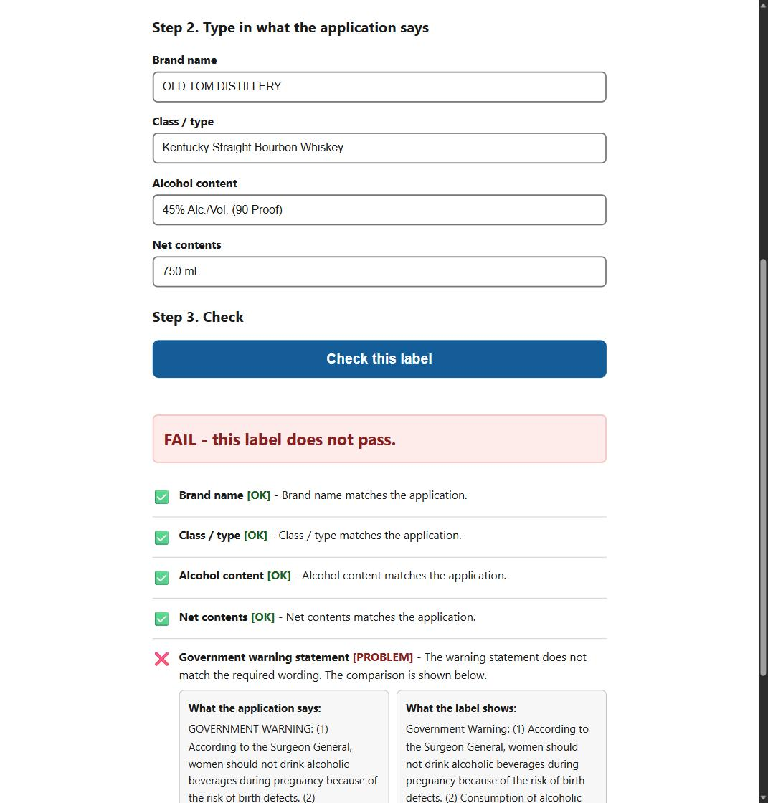

# Alcohol Label Verification

**Live: [https://ttb-label-check-ruddy.vercel.app](https://ttb-label-check-ruddy.vercel.app)**
Upload a label image, get a per-field compliance verdict with timing attached.



## What it does

Given a label image and the expected filing values, it extracts the label's text with a
single vision-model call and checks five fields: brand name, class/type, alcohol
content, net contents, and the mandatory Surgeon General warning statement. It returns
a pass/fail verdict with a plain-language reason for every check, plus per-stage timing
(upload / extract / match / total) in every response.

Batch mode: pick multiple photos and every label runs through the same
extract -> match -> verdict path, at most 3 in flight at a time, with per-label
progress ("4 of 12 done") and results streaming in as each finishes. One label failing
extraction does not stop the rest. Batch is deliberately thin: the browser loops over
the same single-label API - no queue, no server-side batch endpoint, no new
abstractions. Single-label is the same code with n=1.

## Quick start

```bash
git clone <repo> && cd ttb-label-check
# set ANTHROPIC_API_KEY in your environment (or Vercel project env)
npm install
npm run dev                    # http://localhost:3000
npm test                       # matcher test table (14 tests)
node scripts/bench.mjs <url>   # corpus run + latency over test-labels/
```

## Requirements scorecard

Every stated requirement from the derivation in [01-REQUIREMENTS.md](01-REQUIREMENTS.md):

| # | Requirement | Status |
|---|---|---|
| R1 | Upload a label image, get a pass/fail verdict with per-check detail | **Met.** Structured verdict with plain-language reasons and full failure detail. |
| R2 | ~5 s end-to-end (my derived budget, not a spec) | **Not met - deliberate tradeoff.** See below. |
| R3 | Fuzzy brand match (case/punctuation-insensitive) | **Met, with one deliberate deviation:** the spec's Levenshtein >= 0.90 band was removed after fixture #12 proved it passes a one-letter misspelling (0.947). Equal-after-normalization is the rule; unit test pins it. |
| R4 | Byte-exact government warning incl. ALL-CAPS prefix | **Met.** Separate code path, checked-in § 16.21 constant, diff on first difference. Proof-pair #05/#13 passes on every corpus run. |
| R5 | Batch upload with per-item progress (tier 2) | **Met.** Multi-file input, 3 concurrent, streaming per-label results, failure isolation. Limitation: one shared set of expected values per batch, no refresh persistence. |
| R6 | Usable by a non-technical 73-year-old | **Met by design** (18px+ type, 44px+ targets, plain-sentence verdicts, no modals); the formal cold-open test has not been run. |
| R7 | Live deployed URL | **Met.** https://ttb-label-check-ruddy.vercel.app |
| R8 | README with approach, tools, assumptions, limitations, egress note | **Met** - this document. |
| R9 | Markdown doc explaining how AI was used | **Met** - [PROCESS.md](PROCESS.md). |

### The R2 tradeoff, in full

Measured p50 is **6.4 s** against the ~5 s budget (a number I derived from Sarah's
comment about a failed 30-40 s vendor pilot - the brief specifies no latency
requirement). Two things could close the gap, and both were tested rather than assumed:

1. **A faster model.** Sonnet 5 and Haiku 4.5 cut p50 by ~1.3 s and ~2.9 s and score
   16/16 - but both pass fixture #08 by reciting the canonical warning from memory
   instead of reading the illegible pixels. The three verbatim transcriptions are in
   the Model comparison section below; Opus 5's honest garble is the only acceptable
   behavior for a compliance checker, so the faster models are disqualified.
2. **Smaller images.** Re-running the corpus downscaled to 1000 px (from 1600 px):
   16/16 holds, #08 stays honestly garbled ("GOKERNMENT WARNING... risa of birth
   defects... canse health problems"), and p50 drops to **5.5 s** - closer, still not
   5 s, and tail latency got noisier (p95 9.2 s, one 9.4 s outlier).

The underlying tension is between Sarah's speed ask (~5 s) and Jenny's
degraded-images ask (angled, glared, tiny-type labels): resolution and model quality
serve Jenny, and both cost Sarah seconds. **I chose Jenny's side** - the honest-Opus,
1600 px configuration - because a fast wrong answer on a compliance check is worse
than a slow right one, and the failure mode the faster paths introduce (an illegible
warning passing as compliant) is precisely the one the tool exists to prevent. The
1000 px result says most of the remaining gap is image-size, not model, so if ~5.5 s
is acceptable the downscale is a one-line change with corpus-verified safety.

## Performance - measured, honest

Measured 2026-08-13 over the 16-label fixture corpus in `test-labels/`, posted to the
production deployment (Vercel iad1 + Anthropic API) from a residential connection:

| | p50 | p95 | max |
|---|---|---|---|
| Server-side end-to-end | 6,434 ms | 7,685 ms | 8,601 ms |
| - extraction (the vision call) | ~6,400 ms | ~7,600 ms | - |
| - matching (pure string ops) | <10 ms | <10 ms | <10 ms |

**The ~5-second target is not met on this corpus, and the target was never a spec** - I
derived it from a stakeholder's comment about a failed 30-40s vendor pilot. Two honest
caveats in both directions: (1) the bench posts the raw ~2 MB fixture PNGs, while the
browser UI downscales to 1600 px JPEG (~10x smaller) before upload, so the real UI path
is faster than the bench numbers; (2) roughly 1 call in 15 exceeded the old 8 s timeout.
The hard timeout is now **10 seconds** with an explicit error - no retry logic, because a
retry would double worst-case latency and hide exactly the variance reported here.
Extraction is >99% of the cost; matching is effectively free.

### Model comparison

The extraction model is configurable via `EXTRACT_MODEL` (default `claude-opus-5`).
All 16 fixtures, same machine, back-to-back local runs, identical prompt / schema /
timeout (one forced difference: Haiku 4.5 rejects the `effort` parameter, so it ran
without it):

| Model | Pass rate | p50 | p95 |
|---|---|---|---|
| `claude-opus-5` (production default) | 16/16 | 6,364 ms | 7,845 ms |
| `claude-sonnet-5` | 16/16 | 5,057 ms | 7,267 ms |
| `claude-haiku-4-5-20251001` | 16/16 | 3,429 ms | 7,329 ms |

The pass rates are misleading without fixture #08, the deliberately illegible tiny
warning. What each model returned as the warningStatement, verbatim:

Opus 5 (honest transcription of unreadable pixels):

> BOKERNMENT WARNING: (1) According to the Surgeon General, women should not drink
> alcoholic bimenages during pregnancy because of the risa of birth defects. (2)
> Consumption of alaphdic beratagie impairs your ability to drive a car or operate
> machinery, and may canse healdt problems

Sonnet 5 (byte-perfect canonical text -> verdict PASS_WITH_NOTES):

> GOVERNMENT WARNING: (1) According to the Surgeon General, women should not drink
> alcoholic beverages during pregnancy because of the risk of birth defects. (2)
> Consumption of alcoholic beverages impairs your ability to drive a car or operate
> machinery, and may cause health problems.

Haiku 4.5 (identical byte-perfect canonical text -> verdict PASS):

> GOVERNMENT WARNING: (1) According to the Surgeon General, women should not drink
> alcoholic beverages during pregnancy because of the risk of birth defects. (2)
> Consumption of alcoholic beverages impairs your ability to drive a car or operate
> machinery, and may cause health problems.

All three pass 16/16, but the faster models pass #08 by supplying the canonical
27 CFR § 16.21 text from memory rather than transcribing the illegible label - the
exact failure mode that would let an unreadable warning through as compliant. **Opus 5
remains the default despite being ~1.3 s (Sonnet) and ~2.9 s (Haiku) slower at p50:**
for a compliance checker, transcription honesty outranks latency.

## How verification works - two matchers, deliberately separate

**Brand name and other free-text fields - fuzzy** (`lib/match/brand.ts`). Compared after
normalizing case, accents, apostrophes, and punctuation. `STONE'S THROW` vs
`Stone's Throw` passes with a note that capitalization differs: a case difference is a
data-entry artifact, not a compliance failure. Alcohol content additionally compares the
parsed percentage numerically, so `40%` vs `45%` fails on the numbers regardless of
string similarity.

**Warning statement - byte-exact** (`lib/match/warning.ts`). Compared
character-for-character against the 27 CFR § 16.21 text (verified against the eCFR API
and checked in as a constant - never fetched at runtime). The only normalization is
whitespace-runs -> single space. Any other difference fails, and the report shows the
first differing span with context.

**The evidence the paths are separate is the fixture pair #05/#13.** Fixture #05 (the
warning rendered title-case as `Government Warning:`) **fails**, with a diff at the
second character - the exact matcher is case-sensitive. Fixture #13 (the brand rendered
title-case as `Old Tom Distillery` against a filing of `OLD TOM DISTILLERY`) **passes
with a note** - the fuzzy matcher is case-insensitive. One unified "smart" matcher
cannot do both; these two do, and the corpus proves it on every run.

### A deliberate deviation from my own spec: the Levenshtein band is gone

My requirements doc specified fuzzy matching as "Levenshtein ratio >= 0.90 after
normalization -> pass with note." Fixture #12 showed that rule is mathematically broken
for short strings: `OLD TOMM DISTILLERY` vs `OLD TOM DISTILLERY` - a one-letter
misspelling that must fail - scores **0.947**, comfortably above the band. On strings
this short, no threshold can separate a one-character typo from identity. Meanwhile
normalization already absorbs every benign variant the band existed for (case,
apostrophes curly and straight, accents, punctuation). So the rule is now simpler and
strictly better: **equal after normalization -> pass; anything else -> fail.** A unit test
pins the OLD TOMM case.

### The anti-hallucination finding (fixture #08)

Fixture #08 renders the warning in deliberately illegible tiny type. The risk with an
LLM extractor is that it *knows* what the warning is supposed to say and supplies the
canonical text from memory instead of reading the pixels - which would let an illegible
label pass. That did not happen. The extractor transcribed the unreadable pixels
honestly, returning garbled OCR - "...should net drink alcoholic bimerages... may canse
healld probitions..." - which the byte-exact matcher then failed with a diff at position 0.
The extraction prompt's "transcribe exactly as printed, do not correct or normalize"
instruction is load-bearing; this fixture is the regression test for it.

### Fixture regeneration note (#12, #13)

Fixtures #12 and #13 were regenerated during testing: the image generator had omitted
the alcohol-content line from both, so every run failed them on `alcoholContent:MISSING`
- masking the brand-matching signal those two fixtures exist to test. The ABV line was
drawn onto the label area and the images recommitted. The fix was to the fixtures, not
the code: the app had read the images correctly.

## Assumptions

- Images only - JPEG/PNG/WebP. No PDFs or multi-page filings.
- Expected values are typed in with the upload; filing-system integration is out of scope.
- English-language labels, one label per image, front label.

## Network and deployment constraints

This prototype calls a hosted vision API (Anthropic) for text extraction. In a
network-restricted agency environment that egress may not be permitted. Extraction is
isolated behind a single interface (`lib/extract.ts` - the only file that knows a vendor
exists); a self-hosted OCR implementation (PaddleOCR or Tesseract plus the same
field-parsing rules) drops in behind it without touching the matching, API, or UI
layers. The matching logic - where the compliance rules actually live - runs entirely
locally and makes no network calls.

Deployed on Vercel for speed of demonstration. The app is a standard Node service with
one outbound dependency; a container port to Azure Government or AWS GovCloud is
mechanical, not architectural.

## Limitations (what I would not claim this does)

- **Batch has no persistence.** It runs in the browser tab; a refresh mid-run loses
  progress. All labels in one batch are checked against the same typed application
  values - per-label expected values would need a CSV/manifest upload, which is not
  built. At ~6 s/label and 3 concurrent, a 300-label batch takes roughly 10 minutes.
- **27 CFR § 16.22 typography checks are named and declined:** boldness of
  `GOVERNMENT WARNING` (16.22(a)(2)), contrasting background (16.22(a)(1)),
  characters-per-inch limits (16.22(a)(4): <=40 at 1 mm, <=25 at 2 mm, <=12 at 3 mm), and
  minimum type size by container volume (16.22(b): 1 mm <= 237 mL, 2 mm <= 3 L, 3 mm
  above). These require pixel-level physical measurement against a known scale - real
  work, not in scope. The ALL-CAPS requirement of 16.22(a)(2) *is* enforced, free, by
  the byte-exact comparison.
- Extraction accuracy on damaged, angled, or low-contrast photographs is untested at
  scale (the one angled fixture, #16, happened to pass; that is one data point).
- No human-in-the-loop correction - a wrong extraction produces a wrong verdict with no
  override.
- Roughly 1 extraction in 15 on this corpus exceeded 8 s; the timeout is 10 s and a
  timeout surfaces as an explicit error, not a hang or a retry.

## With more time

- Human review queue: flag low-confidence extractions instead of auto-failing.
- Local OCR path implemented behind `lib/extract.ts`, not just seamed.
- Per-field confidence scores surfaced in the UI.
- Batch persistence (server-side job state, resumable runs) and a CSV manifest for
  per-label expected values.

## Choices I made and why

- **One process, no queue, no database.** Nothing in the requirements needs history or
  a broker.
- **One model call per label**, structured JSON output (no parse-retry loop), capped
  output tokens, thinking disabled - all latency decisions.
- **4 runtime dependencies** (next, react, react-dom, @anthropic-ai/sdk).

## How I built this

Built with AI assistance; the account of what was delegated,
what was not, and where the model was wrong is in [PROCESS.md](PROCESS.md). The
requirements contract derived from the stakeholder interviews is in
[01-REQUIREMENTS.md](01-REQUIREMENTS.md); the architecture in
[02-ARCHITECTURE.md](02-ARCHITECTURE.md).
